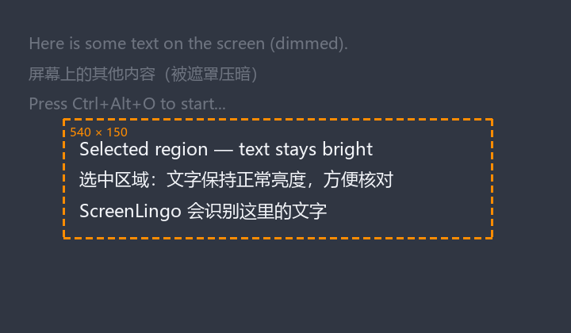

# 🎯 SnapLingo · 截图文字提取 + 中英互译
### Screenshot OCR + Chinese ⇄ English Translation, one global hotkey away

[English](#english-overview) | [中文](#中文总览)

       

---

## 中文总览

### 📖 这是什么？(给 1 分钟了解它)

**ScreenLingo 是一个常驻后台的 Windows 小工具**：无论你在浏览器、PDF、视频还是任何软件里，只要按一下快捷键，框选屏幕上的任意文字区域，它就会：

| 你要做的操作 | 得到的结果 |
|---|---|
| 🌐 **翻译** | 自动识别中英文并互译（中文 → 英文，英文 → 中文） |
| 📋 **复制文字** | 只提取文字，直接进剪贴板 |
| ✨ **翻译 + 复制** | 翻译结果直接进剪贴板 |

从此：网页文字不能复制？截图框一下就出来了。英文论文看不懂？框一下就翻译好了。视频字幕想记录？框一下就复制了。

### 🚀 快速开始（3 步，小白版）

**第 1 步：拿到程序**

> ⬇️ **直接下载**（免安装，双击即用）：
> [](https://github.com/gotahugis14-spec/SnapLingo/releases/latest/download/ScreenLingo.exe)

- 方式 A（推荐，最简单）：点击上方按钮下载最新版，或到 [Releases](../../releases) 页面下载 `ScreenLingo.exe`
- 方式 B：自己从源码运行，见下方 [从源码运行](#从源码运行)

**第 2 步：启动**

双击 `ScreenLingo.exe`。屏幕右下角任务栏（托盘区）出现一个**绿色相机图标**，说明它在后台待命了。**看不到图标？** 点击任务栏右侧的 `^`（显示隐藏图标）就能看到。

**第 3 步：使用**

1. 按下全局快捷键 `Ctrl + Alt + O`
2. 屏幕出现**暗色遮罩**（Windows 截图工具同款**橙色虚线框**），鼠标**拖拽框选**你要识别的区域，松开鼠标
3. 弹出三个选项：🌐 翻译 / 📋 复制文字 / ✨ 翻译+复制，点一个
4. **结果窗口立刻弹出**（先显示加载中），文字识别/翻译完成后**原地更新**，并**自动复制到剪贴板**，直接 `Ctrl + V` 粘贴即可

> 🌐 **切换翻译语种**：结果窗口「译文」标题右侧有目标语种下拉（自动 / 中文 / 英文 / 日文 / 韩文 / 法文 / 德文 / 西班牙文 / 俄文），选择后立即重新翻译并复制，选择会被记住。

> 💡 第一次使用如果提示"未配置 API key"，请看下方 [🔑 API Key 是什么？去哪里获取](#-api-key-是什么去哪里获取新手必看)。

### 🎨 快捷键（全部可以换绑！）

| 快捷键 | 作用 |
|---|---|
| `Ctrl + Alt + O` | 弹操作菜单（翻译 / 复制 / 翻译+复制） |
| `Ctrl + Alt + T` | **直通翻译**：截图后直接翻译，不弹菜单 |
| `Ctrl + Alt + C` | **直通复制**：截图后直接复制文字，不弹菜单 |

**想换成别的键？** 很简单：

1. 右键托盘图标 → 「设置…」
2. 在「菜单快捷键 / 直通翻译快捷键 / 直通复制快捷键」三栏输入新组合，例如：`alt+shift+k`、`f8`、`ctrl+alt+c`
3. 点右下角「确定」——**立即生效，不用重启**

### 📸 效果预览



橙色虚线框 + 暗色遮罩 + 实时尺寸提示（与 Windows 自带截图工具一致）。

### ⚙️ 配置

右键托盘图标 → 「设置…」，可以改：

> 💡 改完记得点**右下角的绿色「确定」按钮**，点按后才会保存并生效（快捷键立即生效，不用重启）。

| 配置项 | 说明 |
|---|---|
| OCR 后端 | `auto`（默认，自动选择）/ `tesseract`（本地离线）/ `api`（云端，最准） |
| 菜单快捷键 | 弹操作菜单的热键（默认 `ctrl+alt+o`） |
| 直通翻译快捷键 | 截图后直接翻译（默认 `ctrl+alt+t`） |
| 直通复制快捷键 | 截图后直接复制文字（默认 `ctrl+alt+c`） |
| API Key | 云端识别/翻译的密钥，输入框右侧有个 👁 小眼睛，点击可切换明文/密文显示 |
| 视觉模型 / 翻译模型 | 默认已配好 SiliconFlow 的模型，一般不用改 |
| 默认翻译方向 | 默认 `自动`（中文→英文、其他→中文）；也可固定为某语种（指定后识别+翻译**一次请求完成，速度更快**） |
| 开机自启 | 勾选后开机自动运行，真正"挂在后台" |

配置文件位置：`%APPDATA%\ScreenLingo\config.json`

#### 🔑 API Key 是什么？去哪里获取？（新手必看）

**API Key 是一串 `sk-` 开头的密钥**，相当于你调用云端 AI 服务的"账号密码"。ScreenLingo 用它来调用云端识别和翻译（默认用 [SiliconFlow / 硅基流动](https://siliconflow.cn)，免费注册就有额度）。

**获取步骤（约 2 分钟）：**

1. 打开 https://cloud.siliconflow.cn ，用手机号或邮箱**注册并登录**
2. 登录后进入左侧菜单的「**API 密钥**」页面（或点右上角头像 → 账户管理 → API 密钥）
3. 点「**新建 API 密钥**」，起个名字（随便填，比如 `screenlingo`），点创建
4. 创建后**立即复制**那串 `sk-` 开头的字符串（关闭页面后不再显示）

**填到哪里：** 托盘右键 → 设置 → 在「API Key」一栏粘贴，点右下角「确定」。

**另一种方式（不打开设置也能配）：** 设置环境变量，key 不会存进任何文件：

```bash
set SILICONFLOW_API_KEY=sk-你的key
```

> 配置也可以直接改 `%APPDATA%\ScreenLingo\config.json` 里的 `api_key` 字段。
> 设置窗口里点「🔑 不知道 API Key 是什么？点这里」会直接打开密钥页面。
> 想用其他 OpenAI 兼容服务？改 `api_base_url` 和模型名即可。

### 🏗️ 从源码运行

```bash
pip install -r requirements.txt
python main.py
```

需要 Python 3.10+（Windows 官方安装包：python.org）

### 📦 自己打包 exe

```bash
build.bat
```

脚本会自动创建干净构建环境、装依赖、打包，产物在 `dist\ScreenLingo.exe`（约 23MB）。拷到任何 Windows 电脑都能直接运行。

### 🧱 项目结构

```
ScreenLingo/
├── main.py          # 入口：托盘 + 全局热键 + 三选项菜单 + 结果窗口
├── snipper.py       # 全屏遮罩 + 鼠标框选截图
├── ocr.py           # OCR 后端：tesseract（本地）/ api（云端）
├── translator.py    # 中英互译（自动检测语言）
├── config.py        # 配置读写（%APPDATA%/ScreenLingo/config.json）
├── build.bat        # 一键打包 exe（自动建 venv）
└── requirements.txt
```

### ❓ 常见问题（FAQ）

**Q：按快捷键没反应？**
A：先确认托盘有绿色图标。如果被其他软件占用了热键，到设置里换一个组合键。仍不行就右键托盘图标 → 退出，然后**以管理员身份**重新运行。

**Q：提示"未配置 API key"？/ API Key 是什么？**
A：API Key 是一串 `sk-` 开头的密钥，在 [SiliconFlow](https://cloud.siliconflow.cn) 注册后，到「API 密钥」页新建并复制即可（详细步骤见上方「🔑 API Key 是什么？」）。配置后重新框选。纯本地用户可把 OCR 后端切到 `tesseract`（需自行安装 Tesseract 和中文语言包 chi_sim）。

**Q：翻译出来不对 / 想要指定翻译方向？**
A：自动互译：有中文字符就翻成英文，其他语言（日/韩/法等）也能识别并翻成中文。

**Q：开了两个 exe 会冲突吗？**
A：不会。程序带单实例锁，重复启动会提示"已经在运行中"并自动退出。

**Q：日志在哪？**
A：`%APPDATA%\ScreenLingo\logs\screenlingo.log`（自动轮转，最多保留 3 份）。报 issue 时附上日志会很有帮助。

**Q：exe 被杀毒软件报毒？**
A：这是 PyInstaller 打包程序的常见误报。本项目完全开源，代码可自查；添加信任即可。

**Q：多显示器能用吗？**
A：v0.2 支持主显示器框选；多显示器适配在规划中。

### 📄 License

[MIT](LICENSE) — 随意使用，注明出处即可。

### ⭐ 支持

觉得好用就点个 Star 吧，这是开源作者最大的动力 ❤️

### 🧑‍🤝‍🧑 贡献者 / Contributors

<a href="https://github.com/gotahugis14-spec"></a>

想一起改进？欢迎提交 Issue / PR，详见 [CONTRIBUTING.md](CONTRIBUTING.md)。

---

## English Overview

### 📖 What is it?

**ScreenLingo is a background Windows utility**: press a global hotkey, drag-select any text on your screen (in a browser, PDF, video, any app), and it will:

| Action | Result |
|---|---|
| 🌐 **Translate** | Auto-detect language and translate to the target language of your choice |
| 📋 **Copy Text** | Extract the text and copy it to clipboard |
| ✨ **Both** | Translate and copy the result |

> 🌐 **Switch target language** right in the result window: the dropdown next to "Translation" offers Auto / Chinese / English / Japanese / Korean / French / German / Spanish / Russian. Your choice is remembered. When a specific language is set, OCR + translation complete in **a single API request** (≈half the latency).

### 🚀 Quick Start (3 steps)

1. **Get the app**: download `ScreenLingo.exe` from [Releases](../../releases) (or double-click the one in the project folder)
2. **Run it**: double-click the exe — a green camera icon appears in the system tray (click `^` if hidden)
3. **Use it**: press `Ctrl + Alt + O` → drag-select the area (orange dashed frame, like Windows Snipping Tool) → choose an action → the result window pops up **instantly** (loading…) and updates in place when done — text is **already in your clipboard**

### 🎨 Hotkeys (all rebindable!)

| Hotkey | Action |
|---|---|
| `Ctrl + Alt + O` | Open action menu (Translate / Copy / Both) |
| `Ctrl + Alt + T` | **Direct translate**: capture → translate immediately |
| `Ctrl + Alt + C` | **Direct copy**: capture → copy text immediately |

Rebind anytime: right-click tray icon → **Settings** → three hotkey fields → **OK**. Takes effect immediately — no restart needed.

### 📸 Preview


Orange dashed frame + dimmed overlay + live size hint (same style as the built-in Windows snipping tool).

### ⚙️ Configuration

Right-click the tray icon → **Settings**:
- **OCR backend**: `auto` (default) / `tesseract` (local, offline) / `api` (cloud, most accurate)
- **Menu hotkey / Direct-translate hotkey / Direct-copy hotkey**: three rebindable hotkeys (defaults `ctrl+alt+o/t/c`)
- **API Key**: the `sk-` key for cloud OCR/translation. Click the 👁 eye icon next to the field to toggle between masked/plain text
- **Vision/Translate model**: preconfigured for SiliconFlow, usually no need to change
- **Autostart**: run at Windows startup

> 💡 Click the green **OK** button at the bottom-right to apply changes (hotkeys rebind immediately, no restart). Single-instance lock prevents double-launch conflicts. Logs: `%APPDATA%\ScreenLingo\logs\screenlingo.log`.

**Where do I get an API Key?** Register at [SiliconFlow](https://cloud.siliconflow.cn) (free tier available) → menu **API Keys** → **Create API Key** → copy the `sk-` string immediately (it won't be shown again). Paste it in Settings → API Key → OK. Alternatively set the env var `SILICONFLOW_API_KEY` so the key never touches a file. Config file: `%APPDATA%\ScreenLingo\config.json`

### 🏗️ Run from source

```bash
pip install -r requirements.txt
python main.py
```

### 📦 Build your own exe

```bash
build.bat
```

Output: `dist\ScreenLingo.exe` (~23 MB), runs on any Windows PC without Python.

### ❓ FAQ

- **Hotkey not working?** Make sure the tray icon is there. If another app grabbed the key, rebind in Settings. Still stuck? Quit via tray menu and re-run **as administrator**.
- **"No API key configured"?** Configure it as above, or switch OCR backend to `tesseract` (install Tesseract + `chi_sim` language pack).
- **Antivirus false positive?** Common for PyInstaller builds. The whole project is open source — check the code yourself and add an exception.

### 📄 License

[MIT](LICENSE)

### ⭐ Support

If this saves you time, a Star means a lot ❤️

### 🧑‍🤝‍🧑 Contributors

<a href="https://github.com/gotahugis14-spec"></a>

Contributions welcome! See [CONTRIBUTING.md](CONTRIBUTING.md).
